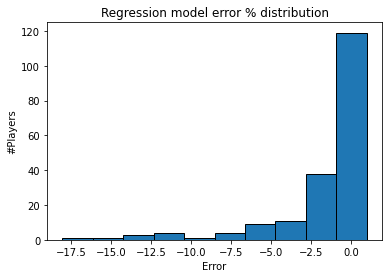
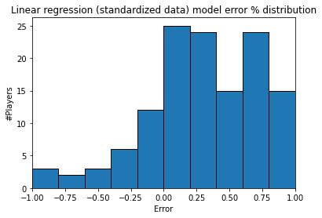
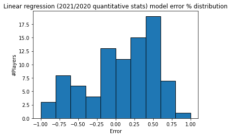
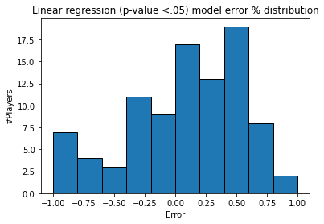

<div id="top"></div>
<!--
*** Thanks for checking out the Best-README-Template. If you have a suggestion
*** that would make this better, please fork the repo and create a pull request
*** or simply open an issue with the tag "enhancement".
*** Don't forget to give the project a star!
*** Thanks again! Now go create something AMAZING! :D
-->


<!-- PROJECT SHIELDS -->
<!--
*** I'm using markdown "reference style" links for readability.
*** Reference links are enclosed in brackets [ ] instead of parentheses ( ).
*** See the bottom of this document for the declaration of the reference variables
*** for contributors-url, forks-url, etc. This is an optional, concise syntax you may use.
*** https://www.markdownguide.org/basic-syntax/#reference-style-links
-->
[![Contributors][contributors-shield]][contributors-url]
[![Forks][forks-shield]][forks-url]
[![Stargazers][stars-shield]][stars-url]
[![Issues][issues-shield]][issues-url]
[![LinkedIn][linkedin-shield]][linkedin-url]


<!-- PROJECT LOGO -->
<br />
<div align="center">
  <a href="https://github.com/camiloms10/soccer_players_value">
    
  </a>

<h3 align="center">Soccer Players Value Prediction Model</h3>

  <p align="center">
    This project was made using Python, specifically Pandas and ScikitLearn, to analyze the top Soccer Players market value after the 2021/2020 season, and generating a prediction model to for this value.
    <br />
    <a href="https://github.com/camiloms10/soccer_players_value"><strong>Explore the docs »</strong></a>
    <br />
    <br />
    <a href="https://github.com/camiloms10/soccer_players_value/issues">Report Bug</a>
    ·
    <a href="https://github.com/camiloms10/soccer_players_value/issues">Request Feature</a>
  </p>
</div>


<!-- TABLE OF CONTENTS -->
<details>
  <summary>Table of Contents</summary>
  <ol>
    <li>
      <a href="#about-the-project">About The Project</a>
      <ul>
        <li><a href="#built-with">Built With</a></li>
      </ul>
    </li>
    <li>
      <a href="#getting-started">Getting Started</a>
      <ul>
        <li><a href="#prerequisites">Prerequisites</a></li>
        <li><a href="#data-sources">Data Sources</a></li>
      </ul>
    </li>
    <li><a href="#usage">Usage</a></li>
    <li><a href="#roadmap">Roadmap</a></li>
    <!--<li><a href="#contributing">Contributing</a></li>-->
    <!--<li><a href="#license">License</a></li>-->
    <li><a href="#contact">Contact</a></li>
    <!--<li><a href="#acknowledgments">Acknowledgments</a></li>-->
  </ol>
</details>


<!-- ABOUT THE PROJECT -->
## About The Project


Through this project you´ll find multiple prediction models. such as multiple linear regression and random forest, in order to find best fit between the independent variables (player statistics through the season) and the dependent variable (Value).
<p align="right">(<a href="#top">back to top</a>)</p>


### Built With

* [Python](https://www.python.org)

<p align="right">(<a href="#top">back to top</a>)</p>


<!-- GETTING STARTED -->
## Getting Started


### Prerequisites

These are the python libraries you´ll need to run the ipynb file.
* Libraries
  ```sh
  pip install numpy
  pip install seaborn 
  pip install matplotlib
  pip install pandas
  pip install sklearn 
  pip install scipy
   ```

<p align="right">(<a href="#top">back to top</a>)</p>

### Data Sources

The data source of this project where downloaded from [Kaggle](https://www.kaggle.com/sanjitva/predicting-soccer-player-transfer-values)
* These are the csv files used inside the project

  * **players_stats_value.xlsx :** Top 2500 players based on market value and their 2021-2017 statistics (goals, assists, passes leading to goals, crosses, tackles, etc.)

<p align="right">(<a href="#top">back to top</a>)</p>


<!-- USAGE EXAMPLES -->
## Usage

You can use this data to analyze:
* How a player has performed through time
* The correlation between individual statistics and player value
* Predict player´s value based on individual statistics (this is what we´ll focus on)
* Etc.
<p align="right">(<a href="#top">back to top</a>)</p>


<!-- ROADMAP -->
## Roadmap

To do ALL of the following analysis first I did the import via pd.read_excel commands and changed the dataframes as I needed to, you can check that inside the [.ipynb file](players_value.ipynb) with the step by step solution.

**I used the 90% of the dataframes to train the models and the remaining 10% to test the model.**

### 1. Regression and Random Forest (using most correlated 2021/2020 season stats vs. player Value)

<p align ="center">

|                                                | Value               |
|------------------------------------------------|---------------------|
| Value                                          | 1.0                 |
| Goal Creating Actions (20/21)                  | 0.5182500696903144  |
| Total Carries in Forward Direction (20/21)     | 0.5129803351797286  |
| Number of Times Player was Pass Target (20/21) | 0.5118986575690919  |
| Passes Leading to Goals (20/21)                | 0.5096111547070523  |
| Non-penalty xG+ xA (20/21)                     | 0.5083183735823256  |
| Passes Leading to Shot Attempt (20/21)         | 0.5031947476181425  |
| Touches in Attacking Penalty Box (20/21)       | 0.49484671236655164 |


* I got 7 results >= .49 correlation between them and value
* We got a .36 score for our linear regression model considering the top 7 variables correlated to Value, as this score is still low we´re going to try other approaches to increase it.
  
<p align ="center">


</p>
* Then I tried using the Random Forest prediticon model using those same indepentent variables we used in the regression model and increased the score from .36... to approximately .38.

</p>


### 2. Standardizing my dataframe using ScikitLearn StandardScaler

<p align ="center">

|   | Value             | Goal Creating Actions (20/21) | Total Carries in Forward Direction (20/21) | Number of Times Player was Pass Target (20/21) | Passes Leading to Goals (20/21) | Non-penalty xG+ xA (20/21) | Passes Leading to Shot Attempt (20/21) | Touches in Attacking Penalty Box (20/21) |
|---|-------------------|-------------------------------|--------------------------------------------|------------------------------------------------|---------------------------------|----------------------------|----------------------------------------|------------------------------------------|
| 0 | 8.83416419601431  | 5.2149035180193435            | 3.0888723567336447                         | 1.5853588482790255                             | 3.2291146602806995              | 4.9325641354366105         | 2.2281528228750886                     | 5.459029630475353                        |
| 1 | 7.031431813358088 | 2.6141465522461735            | 0.11944508802251795                        | 0.5744640680313485                             | 2.292357521590521               | 5.2136219209315735         | 0.7790340910270162                     | 3.4721126362883212                       |
| 2 | 6.430521019139348 | 4.564714276576051             | 1.2778480335087268                         | 1.8694281179222683                             | 3.8536194194074853              | 4.955985617561191          | 2.2764567806033575                     | 2.92399760340914                         |
| 3 | 5.228699430701866 | 3.9145250351327587            | 2.7299305989773544                         | 1.736209425951644                              | 4.478124178534271               | 2.2859366553590377         | 3.0976240619839315                     | 2.193177559570232                        |
| 4 | 5.228699430701866 | 2.1806870579506454            | 2.3873043756645322                         | 2.6060491205833665                             | 2.292357521590521               | 4.440713010820425          | 3.0976240619839315                     | 6.281202179794125                        |
</p>


* The regression using the standardized dataframe didn´t have the effect we were looking for, as it gave us the same .36 we had with the initial dataframes.

</p>

<p align ="center">

<p align ="center">
We´re limiting this histogram from -100% error to 100% error to appreciate the predictions better in this range, but we got outliers out of this limits.
</p>
</p>


### 3. Using all of 2021-2020 quantitative statistics

<p align ="center">

|   | Value     | Contract Years Left | Starts (20/21) | Min (20/21) | Total Mins/90 (20/21) | Gls (20/21) | Ast (20/21) | Non-Penalty Goals (20/21) | Penalties Scored (20/21) | Penalties Attempted (20/21) | Yellow Cards (20/21) | Red Cards (20/21) | Gls/90 (20/21) | Ast/90 (20/21) | (G+A)/90 (20/21) | Non-Penalty Goals/90 (20/21) | (Gls+Ast-Scored Penalties)/90 (20/21) | xG (20/21) | Non-Penalty xG (20/21) | xA (20/21) | Non-penalty xG+ xA (20/21) | xG/90 (20/21) | xA/90 (20/21) | (xG+xA)/90 (20/21) | Non-Penalty xG/90 (20/21) | (Non-Penalty xG+xA)/90 (20/21) | Total Shots (20/21) | Total Shots on Target (20/21) | Shots on Target% (20/21) | Shots/90 (20/21) | Shots on Target/90 (20/21) | Goals/Shots (20/21) | Goals/Shots on Target (20/21) | Freekick Shots (20/21) | Non-Penalty xG/Shots (20/21) | Goals Scored minus xG (20/21) | Non-Penalty Goals Scored minus Non-Penalty xG (20/21) | Shot-Creating Actions (20/21) | Shot-Creating Actions/90 (20/21) | Passes Leading to Shot Attempt (20/21) | Set-Piece Leading to Shot Attempt (20/21) | Dribbles Leading to Shot Attempt (20/21) | Shots Leading to Shot Attempt (20/21) | Fouls Drawn Leading to Shot Attempt (20/21) | Defensive Actions Leading to Shot Attempt (20/21) | Goal Creating Actions (20/21) | Goal Creating Actions/90 (20/21) | Passes Leading to Goals (20/21) | Set-Piece Leading to Goals (20/21) | Dribbles Leading to Goals (20/21) | Shots Leading to Goals (20/21) | Fouls Drawn Leading to Goals (20/21) | Defensive Actions Leading to Goals (20/21) | Touches (20/21) | Touches in Defensive Penalty Box (20/21) | Touches in Defensive 3rd (20/21) | Touches in Midfield 3rd (20/21) | Touches in Attacking 3rd (20/21) | Touches in Attacking Penalty Box (20/21) | Touches in Open-play (20/21) | Total Successful Dribbles (20/21) | Total Attempted Dribbles (20/21) | Dribble Success % (20/21) | Total no. of Players Dribbles Past (20/21) | Total Nutmegs (20/21) | Total Carries (20/21) | Total Distance Carried the Ball (20/21) | Total Distance Carried the Ball in Forward Direction (20/21) | Total Carries in Forward Direction (20/21) | Carries into Final Third (20/21) | Carries into Attacking Penalty Box (20/21) | Total Failed Attempts at Controlling Ball (20/21) | Number of Times Tackled when Dribbling (20/21) | Number of Times Player was Pass Target (20/21) | Number of Times Received Pass (20/21) | Progressive Passes Received (20/21) | Passes Completed (All pass-types) (20/21) | Passes Attempted (All pass-types) (20/21) | Pass Completion % (All pass-types) (20/21) | Total Distance of Completed Passes (All Pass-types) (20/21) | Total Distance of Completed Progressive Passes (All Pass-types) (20/21) | Passes Completed (Short Passes) (20/21) | Passes Attempted (Short Passes) (20/21) | Pass Completion % (Short Passes) (20/21) | Passes Completed (Medium Passes) (20/21) | Passes Attempted (Medium Passes) (20/21) | Pass Completion % (Medium Passes) (20/21) | Passes Completed (Long Passes) (20/21) | Passes Attempted (Long Passes) (20/21) | Pass Completion % (Long Passes) (20/21) | Total Assists (20/21) | xG Assisted (20/21) | Assist minus xG Assisted (20/21) | Completed passes that enter Final 3rd (20/21) | Completed passes that enter Penalty Box (20/21) | Completed Crosses that enter Penalty Box (20/21) | Total Completed Progressive Passes (20/21) | Total Number of Players Tackled (20/21) | Total Tackles Won (20/21) | Tackles in Defensive 3rd (20/21) | Tackles in Midfield 3rd (20/21) | Tackles in Attacking 3rd (20/21) | Number of Dribblers Tackled (20/21) | Times Dribbled Past + Total Tackles (20/21) | Number of Times Dribbled Past (20/21) | Number of Pressing Actions (20/21) | Times Squad gained Possession within 5 seconds of Pressing Actions (20/21) | Successful Pressure % (20/21) | Number of Presses in Defensive Third (20/21) | Number of Presses in Midfield Third (20/21) | Number of Presses in Attacking Third (20/21) | Total Defensive Blocks (20/21) | Total Shots Blocked (20/21) | Times blocked a Pass (20/21) | Total Interceptions (20/21) | Total Players Tackled + Total Interceptions (20/21) | Total Clearances (20/21) | Mistakes leading to Opponent Shots (20/21) | 2nd Yellow Cards (20/21) | Fouls Committed (20/21) | Fouls Drawn (20/21) | Offsides (20/21) | Crosses (20/21) | Interceptions (20/21) | Penalty Kicks Won (20/21) | Penalties Conceded (20/21) | Own Goals (20/21) | Total Loose Balls Recovered (20/21) | Aerial Duel Won (20/21) | Aerial Duel Lost (20/21) |
|---|-----------|---------------------|----------------|-------------|-----------------------|-------------|-------------|---------------------------|--------------------------|-----------------------------|----------------------|-------------------|----------------|----------------|------------------|------------------------------|---------------------------------------|------------|------------------------|------------|----------------------------|---------------|---------------|--------------------|---------------------------|--------------------------------|---------------------|-------------------------------|--------------------------|------------------|----------------------------|---------------------|-------------------------------|------------------------|------------------------------|-------------------------------|-------------------------------------------------------|-------------------------------|----------------------------------|----------------------------------------|-------------------------------------------|------------------------------------------|---------------------------------------|---------------------------------------------|---------------------------------------------------|-------------------------------|----------------------------------|---------------------------------|------------------------------------|-----------------------------------|--------------------------------|--------------------------------------|--------------------------------------------|-----------------|------------------------------------------|----------------------------------|---------------------------------|----------------------------------|------------------------------------------|------------------------------|-----------------------------------|----------------------------------|---------------------------|--------------------------------------------|-----------------------|-----------------------|-----------------------------------------|--------------------------------------------------------------|--------------------------------------------|----------------------------------|--------------------------------------------|---------------------------------------------------|------------------------------------------------|------------------------------------------------|---------------------------------------|-------------------------------------|-------------------------------------------|-------------------------------------------|--------------------------------------------|-------------------------------------------------------------|-------------------------------------------------------------------------|-----------------------------------------|-----------------------------------------|------------------------------------------|------------------------------------------|------------------------------------------|-------------------------------------------|----------------------------------------|----------------------------------------|-----------------------------------------|-----------------------|---------------------|----------------------------------|-----------------------------------------------|-------------------------------------------------|--------------------------------------------------|--------------------------------------------|-----------------------------------------|---------------------------|----------------------------------|---------------------------------|----------------------------------|-------------------------------------|---------------------------------------------|---------------------------------------|------------------------------------|----------------------------------------------------------------------------|-------------------------------|----------------------------------------------|---------------------------------------------|----------------------------------------------|--------------------------------|-----------------------------|------------------------------|-----------------------------|-----------------------------------------------------|--------------------------|--------------------------------------------|--------------------------|-------------------------|---------------------|------------------|-----------------|-----------------------|---------------------------|----------------------------|-------------------|-------------------------------------|-------------------------|--------------------------|
| 0 | 144000000 | 1.0                 | 27.0           | 2380.0      | 26.4                  | 27.0        | 7.0         | 21.0                      | 6.0                      | 6.0                         | 5.0                  | 0.0               | 1.02           | 0.26           | 1.29             | 0.79                         | 1.06                                  | 24.6       | 20.1                   | 4.6        | 24.7                       | 0.93          | 0.17          | 1.11               | 0.76                      | 0.93                           | 98.0                | 47.0                          | 48.0                     | 3.71             | 1.78                       | 0.21                | 0.45                          | 2.0                    | 0.2                          | 2.4                           | 0.9                                                   | 107.0                         | 4.05                             | 69.0                                   | 0.0                                       | 19.0                                     | 7.0                                   | 10.0                                        | 2.0                                               | 28.0                          | 1.06                             | 13.0                            | 0.0                                | 7.0                               | 2.0                            | 5.0                                  | 1.0                                        | 1442.0          | 6.0                                      | 59.0                             | 493.0                           | 1021.0                           | 277.0                                    | 1386.0                       | 88.0                              | 189.0                            | 46.6                      | 98.0                                       | 15.0                  | 1163.0                | 6385.0                                  | 4313.0                                                       | 261.0                                      | 72.0                             | 69.0                                       | 72.0                                              | 65.0                                           | 1616.0                                         | 1221.0                                | 322.0                               | 812.0                                     | 1033.0                                    | 78.6                                       | 11138.0                                                     | 2052.0                                                                  | 519.0                                   | 618.0                                   | 84.0                                     | 232.0                                    | 279.0                                    | 83.2                                      | 32.0                                   | 59.0                                   | 54.2                                    | 7.0                   | 4.6                 | 2.4                              | 37.0                                          | 36.0                                            | 6.0                                              | 61.0                                       | 9.0                                     | 5.0                       | 3.0                              | 1.0                             | 5.0                              | 2.0                                 | 11.0                                        | 9.0                                   | 183.0                              | 57.0                                                                       | 31.1                          | 7.0                                          | 52.0                                        | 124.0                                        | 12.0                           | 1.0                         | 11.0                         | 7.0                         | 16.0                                                | 7.0                      | 1.0                                        | 0.0                      | 23.0                    | 38.0                | 17.0             | 68.0            | 7.0                   | 4.0                       | 0.0                        | 0.0               | 109.0                               | 7.0                     | 8.0                      |
| 1 | 117000000 | 3.0                 | 27.0           | 2407.0      | 26.7                  | 27.0        | 6.0         | 25.0                      | 2.0                      | 4.0                         | 2.0                  | 0.0               | 1.01           | 0.22           | 1.23             | 0.93                         | 1.16                                  | 23.7       | 20.5                   | 5.4        | 25.9                       | 0.89          | 0.2           | 1.09               | 0.77                      | 0.97                           | 90.0                | 47.0                          | 52.2                     | 3.37             | 1.76                       | 0.28                | 0.53                          | 0.0                    | 0.23                         | 3.3                           | 4.5                                                   | 62.0                          | 2.32                             | 39.0                                   | 0.0                                       | 10.0                                     | 9.0                                   | 3.0                                         | 1.0                                               | 16.0                          | 0.6                              | 10.0                            | 0.0                                | 4.0                               | 2.0                            | 0.0                                  | 0.0                                        | 762.0           | 28.0                                     | 46.0                             | 319.0                           | 444.0                            | 190.0                                    | 716.0                        | 28.0                              | 43.0                             | 65.1                      | 29.0                                       | 0.0                   | 461.0                 | 2326.0                                  | 1364.0                                                       | 79.0                                       | 27.0                             | 23.0                                       | 56.0                                              | 23.0                                           | 1100.0                                         | 548.0                                 | 222.0                               | 360.0                                     | 490.0                                     | 73.5                                       | 4932.0                                                      | 811.0                                                                   | 222.0                                   | 286.0                                   | 77.6                                     | 99.0                                     | 135.0                                    | 73.3                                      | 17.0                                   | 30.0                                   | 56.7                                    | 6.0                   | 5.4                 | 0.6                              | 17.0                                          | 17.0                                            | 0.0                                              | 32.0                                       | 7.0                                     | 6.0                       | 2.0                              | 2.0                             | 3.0                              | 1.0                                 | 10.0                                        | 9.0                                   | 320.0                              | 105.0                                                                      | 32.8                          | 8.0                                          | 90.0                                        | 222.0                                        | 20.0                           | 9.0                         | 11.0                         | 5.0                         | 12.0                                                | 15.0                     | 0.0                                        | 0.0                      | 21.0                    | 22.0                | 15.0             | 13.0            | 5.0                   | 0.0                       | 0.0                        | 0.0               | 96.0                                | 37.0                    | 40.0                     |
| 2 | 108000000 | 3.0                 | 35.0           | 3082.0      | 34.2                  | 23.0        | 14.0        | 19.0                      | 4.0                      | 4.0                         | 1.0                  | 0.0               | 0.67           | 0.41           | 1.08             | 0.55                         | 0.96                                  | 20.5       | 17.5                   | 7.4        | 24.8                       | 0.6           | 0.22          | 0.81               | 0.51                      | 0.73                           | 134.0               | 47.0                          | 35.1                     | 3.91             | 1.37                       | 0.14                | 0.4                           | 14.0                   | 0.13                         | 2.5                           | 1.5                                                   | 113.0                         | 3.3                              | 70.0                                   | 2.0                                       | 18.0                                     | 9.0                                   | 12.0                                        | 2.0                                               | 25.0                          | 0.73                             | 15.0                            | 1.0                                | 6.0                               | 0.0                            | 3.0                                  | 0.0                                        | 1396.0          | 50.0                                     | 142.0                            | 736.0                           | 616.0                            | 166.0                                    | 1341.0                       | 46.0                              | 79.0                             | 58.2                      | 47.0                                       | 8.0                   | 897.0                 | 4616.0                                  | 2537.0                                                       | 150.0                                      | 53.0                             | 26.0                                       | 61.0                                              | 71.0                                           | 1761.0                                         | 1055.0                                | 223.0                               | 657.0                                     | 937.0                                     | 70.1                                       | 12519.0                                                     | 3835.0                                                                  | 300.0                                   | 385.0                                   | 77.9                                     | 236.0                                    | 316.0                                    | 74.7                                      | 102.0                                  | 170.0                                  | 60.0                                    | 14.0                  | 7.4                 | 6.6                              | 98.0                                          | 41.0                                            | 7.0                                              | 125.0                                      | 18.0                                    | 12.0                      | 3.0                              | 12.0                            | 3.0                              | 5.0                                 | 20.0                                        | 15.0                                  | 391.0                              | 99.0                                                                       | 25.3                          | 21.0                                         | 190.0                                       | 180.0                                        | 30.0                           | 13.0                        | 17.0                         | 15.0                        | 33.0                                                | 41.0                     | 0.0                                        | 0.0                      | 26.0                    | 60.0                | 12.0             | 37.0            | 15.0                  | 2.0                       | 0.0                        | 0.0               | 155.0                               | 90.0                    | 129.0                    |
| 3 | 90000000  | 5.0                 | 24.0           | 2062.0      | 22.9                  | 8.0         | 11.0        | 7.0                       | 1.0                      | 1.0                         | 0.0                  | 0.0               | 0.35           | 0.48           | 0.83             | 0.31                         | 0.79                                  | 7.4        | 6.6                    | 6.8        | 13.4                       | 0.32          | 0.3           | 0.62               | 0.29                      | 0.58                           | 51.0                | 15.0                          | 29.4                     | 2.23             | 0.65                       | 0.14                | 0.47                          | 2.0                    | 0.13                         | 0.6                           | 0.4                                                   | 125.0                         | 5.46                             | 87.0                                   | 21.0                                      | 11.0                                     | 3.0                                   | 2.0                                         | 1.0                                               | 22.0                          | 0.96                             | 17.0                            | 1.0                                | 1.0                               | 1.0                            | 2.0                                  | 0.0                                        | 1791.0          | 18.0                                     | 154.0                            | 721.0                           | 1064.0                           | 134.0                                    | 1653.0                       | 91.0                              | 163.0                            | 55.8                      | 96.0                                       | 16.0                  | 1412.0                | 7503.0                                  | 4320.0                                                       | 239.0                                      | 81.0                             | 51.0                                       | 58.0                                              | 41.0                                           | 1693.0                                         | 1403.0                                | 218.0                               | 1160.0                                    | 1474.0                                    | 78.7                                       | 17976.0                                                     | 5317.0                                                                  | 655.0                                   | 754.0                                   | 86.9                                     | 393.0                                    | 471.0                                    | 83.4                                      | 87.0                                   | 167.0                                  | 52.1                                    | 11.0                  | 6.8                 | 4.2                              | 56.0                                          | 82.0                                            | 5.0                                              | 148.0                                      | 16.0                                    | 11.0                      | 4.0                              | 7.0                             | 5.0                              | 8.0                                 | 19.0                                        | 11.0                                  | 255.0                              | 93.0                                                                       | 36.5                          | 39.0                                         | 104.0                                       | 112.0                                        | 38.0                           | 1.0                         | 37.0                         | 14.0                        | 30.0                                                | 8.0                      | 0.0                                        | 0.0                      | 1.0                     | 22.0                | 9.0              | 52.0            | 14.0                  | 0.0                       | 0.0                        | 0.0               | 154.0                               | 5.0                     | 22.0                     |
| 4 | 90000000  | 2.0                 | 34.0           | 3078.0      | 34.2                  | 22.0        | 5.0         | 16.0                      | 6.0                      | 6.0                         | 0.0                  | 0.0               | 0.64           | 0.15           | 0.79             | 0.47                         | 0.61                                  | 20.9       | 16.4                   | 6.3        | 22.6                       | 0.61          | 0.18          | 0.79               | 0.48                      | 0.66                           | 120.0               | 46.0                          | 38.3                     | 3.51             | 1.35                       | 0.13                | 0.35                          | 1.0                    | 0.14                         | 1.1                           | -0.4                                                  | 117.0                         | 3.42                             | 87.0                                   | 1.0                                       | 6.0                                      | 12.0                                  | 7.0                                         | 4.0                                               | 14.0                          | 0.41                             | 10.0                            | 0.0                                | 0.0                               | 2.0                            | 2.0                                  | 0.0                                        | 1758.0          | 13.0                                     | 70.0                             | 621.0                           | 1162.0                           | 313.0                                    | 1724.0                       | 50.0                              | 98.0                             | 51.0                      | 56.0                                       | 2.0                   | 1367.0                | 6332.0                                  | 3460.0                                                       | 218.0                                      | 52.0                             | 54.0                                       | 115.0                                             | 92.0                                           | 2137.0                                         | 1444.0                                | 415.0                               | 1071.0                                    | 1288.0                                    | 83.2                                       | 16219.0                                                     | 3877.0                                                                  | 632.0                                   | 696.0                                   | 90.8                                     | 342.0                                    | 409.0                                    | 83.6                                      | 63.0                                   | 100.0                                  | 63.0                                    | 5.0                   | 6.3                 | -1.3                             | 61.0                                          | 74.0                                            | 12.0                                             | 137.0                                      | 26.0                                    | 13.0                      | 6.0                              | 7.0                             | 13.0                             | 6.0                                 | 16.0                                        | 10.0                                  | 553.0                              | 153.0                                                                      | 27.7                          | 45.0                                         | 165.0                                       | 343.0                                        | 14.0                           | 1.0                         | 13.0                         | 9.0                         | 35.0                                                | 11.0                     | 1.0                                        | 0.0                      | 22.0                    | 22.0                | 13.0             | 47.0            | 9.0                   | 2.0                       | 0.0                        | 0.0               | 191.0                               | 21.0                    | 52.0                     |
</p>
<p align ="center">

<p align ="center">
We can see how the distribution is more centralized (between -1,1) vs. the previous prediction models.
</p>
</p>

* **We went from having previous predictive scores between .36-.38 to a .59 score** this means our model can predict correctly 59% of the tests we do, that´s a huge improvement using all the cuantitative variables from the 2021/2020 season instead of the most correlated (>.5)

### 4. Variables significance (p-value)

<p align ="center">

|   | Value     | Starts (20/21) | Min (20/21) | Total Mins/90 (20/21) | Gls (20/21) | Ast (20/21) | Non-Penalty Goals (20/21) | Penalties Scored (20/21) | Penalties Attempted (20/21) | Gls/90 (20/21) | Ast/90 (20/21) | (G+A)/90 (20/21) | Non-Penalty Goals/90 (20/21) | (Gls+Ast-Scored Penalties)/90 (20/21) | xG (20/21) | Non-Penalty xG (20/21) | xA (20/21) | Non-penalty xG+ xA (20/21) | xG/90 (20/21) | xA/90 (20/21) | (xG+xA)/90 (20/21) | Non-Penalty xG/90 (20/21) | (Non-Penalty xG+xA)/90 (20/21) | Total Shots (20/21) | Total Shots on Target (20/21) | Shots/90 (20/21) | Shots on Target/90 (20/21) | Goals/Shots (20/21) | Goals/Shots on Target (20/21) | Freekick Shots (20/21) | Non-Penalty xG/Shots (20/21) | Goals Scored minus xG (20/21) | Non-Penalty Goals Scored minus Non-Penalty xG (20/21) | Shot-Creating Actions (20/21) | Shot-Creating Actions/90 (20/21) | Passes Leading to Shot Attempt (20/21) | Set-Piece Leading to Shot Attempt (20/21) | Dribbles Leading to Shot Attempt (20/21) | Shots Leading to Shot Attempt (20/21) | Fouls Drawn Leading to Shot Attempt (20/21) | Defensive Actions Leading to Shot Attempt (20/21) | Goal Creating Actions (20/21) | Goal Creating Actions/90 (20/21) | Passes Leading to Goals (20/21) | Set-Piece Leading to Goals (20/21) | Dribbles Leading to Goals (20/21) | Shots Leading to Goals (20/21) | Fouls Drawn Leading to Goals (20/21) | Defensive Actions Leading to Goals (20/21) | Touches (20/21) | Touches in Defensive Penalty Box (20/21) | Touches in Defensive 3rd (20/21) | Touches in Midfield 3rd (20/21) | Touches in Attacking 3rd (20/21) | Touches in Attacking Penalty Box (20/21) | Touches in Open-play (20/21) | Total Successful Dribbles (20/21) | Total Attempted Dribbles (20/21) | Total no. of Players Dribbles Past (20/21) | Total Nutmegs (20/21) | Total Carries (20/21) | Total Distance Carried the Ball (20/21) | Total Distance Carried the Ball in Forward Direction (20/21) | Total Carries in Forward Direction (20/21) | Carries into Final Third (20/21) | Carries into Attacking Penalty Box (20/21) | Total Failed Attempts at Controlling Ball (20/21) | Number of Times Tackled when Dribbling (20/21) | Number of Times Player was Pass Target (20/21) | Number of Times Received Pass (20/21) | Progressive Passes Received (20/21) | Passes Completed (All pass-types) (20/21) | Passes Attempted (All pass-types) (20/21) | Pass Completion % (All pass-types) (20/21) | Total Distance of Completed Passes (All Pass-types) (20/21) | Total Distance of Completed Progressive Passes (All Pass-types) (20/21) | Passes Completed (Short Passes) (20/21) | Passes Attempted (Short Passes) (20/21) | Pass Completion % (Short Passes) (20/21) | Passes Completed (Medium Passes) (20/21) | Passes Attempted (Medium Passes) (20/21) | Pass Completion % (Medium Passes) (20/21) | Passes Completed (Long Passes) (20/21) | Passes Attempted (Long Passes) (20/21) | Pass Completion % (Long Passes) (20/21) | Total Assists (20/21) | xG Assisted (20/21) | Assist minus xG Assisted (20/21) | Completed passes that enter Final 3rd (20/21) | Completed passes that enter Penalty Box (20/21) | Completed Crosses that enter Penalty Box (20/21) | Total Completed Progressive Passes (20/21) | Total Number of Players Tackled (20/21) | Total Tackles Won (20/21) | Tackles in Midfield 3rd (20/21) | Tackles in Attacking 3rd (20/21) | Number of Dribblers Tackled (20/21) | Times Dribbled Past + Total Tackles (20/21) | Number of Times Dribbled Past (20/21) | Number of Pressing Actions (20/21) | Times Squad gained Possession within 5 seconds of Pressing Actions (20/21) | Successful Pressure % (20/21) | Number of Presses in Midfield Third (20/21) | Number of Presses in Attacking Third (20/21) | Total Defensive Blocks (20/21) | Times blocked a Pass (20/21) | Total Interceptions (20/21) | Total Players Tackled + Total Interceptions (20/21) | Fouls Committed (20/21) | Fouls Drawn (20/21) | Offsides (20/21) | Crosses (20/21) | Interceptions (20/21) | Penalty Kicks Won (20/21) | Total Loose Balls Recovered (20/21) | Aerial Duel Won (20/21) | Aerial Duel Lost (20/21) |
|---|-----------|----------------|-------------|-----------------------|-------------|-------------|---------------------------|--------------------------|-----------------------------|----------------|----------------|------------------|------------------------------|---------------------------------------|------------|------------------------|------------|----------------------------|---------------|---------------|--------------------|---------------------------|--------------------------------|---------------------|-------------------------------|------------------|----------------------------|---------------------|-------------------------------|------------------------|------------------------------|-------------------------------|-------------------------------------------------------|-------------------------------|----------------------------------|----------------------------------------|-------------------------------------------|------------------------------------------|---------------------------------------|---------------------------------------------|---------------------------------------------------|-------------------------------|----------------------------------|---------------------------------|------------------------------------|-----------------------------------|--------------------------------|--------------------------------------|--------------------------------------------|-----------------|------------------------------------------|----------------------------------|---------------------------------|----------------------------------|------------------------------------------|------------------------------|-----------------------------------|----------------------------------|--------------------------------------------|-----------------------|-----------------------|-----------------------------------------|--------------------------------------------------------------|--------------------------------------------|----------------------------------|--------------------------------------------|---------------------------------------------------|------------------------------------------------|------------------------------------------------|---------------------------------------|-------------------------------------|-------------------------------------------|-------------------------------------------|--------------------------------------------|-------------------------------------------------------------|-------------------------------------------------------------------------|-----------------------------------------|-----------------------------------------|------------------------------------------|------------------------------------------|------------------------------------------|-------------------------------------------|----------------------------------------|----------------------------------------|-----------------------------------------|-----------------------|---------------------|----------------------------------|-----------------------------------------------|-------------------------------------------------|--------------------------------------------------|--------------------------------------------|-----------------------------------------|---------------------------|---------------------------------|----------------------------------|-------------------------------------|---------------------------------------------|---------------------------------------|------------------------------------|----------------------------------------------------------------------------|-------------------------------|---------------------------------------------|----------------------------------------------|--------------------------------|------------------------------|-----------------------------|-----------------------------------------------------|-------------------------|---------------------|------------------|-----------------|-----------------------|---------------------------|-------------------------------------|-------------------------|--------------------------|
| 0 | 144000000 | 27.0           | 2380.0      | 26.4                  | 27.0        | 7.0         | 21.0                      | 6.0                      | 6.0                         | 1.02           | 0.26           | 1.29             | 0.79                         | 1.06                                  | 24.6       | 20.1                   | 4.6        | 24.7                       | 0.93          | 0.17          | 1.11               | 0.76                      | 0.93                           | 98.0                | 47.0                          | 3.71             | 1.78                       | 0.21                | 0.45                          | 2.0                    | 0.2                          | 2.4                           | 0.9                                                   | 107.0                         | 4.05                             | 69.0                                   | 0.0                                       | 19.0                                     | 7.0                                   | 10.0                                        | 2.0                                               | 28.0                          | 1.06                             | 13.0                            | 0.0                                | 7.0                               | 2.0                            | 5.0                                  | 1.0                                        | 1442.0          | 6.0                                      | 59.0                             | 493.0                           | 1021.0                           | 277.0                                    | 1386.0                       | 88.0                              | 189.0                            | 98.0                                       | 15.0                  | 1163.0                | 6385.0                                  | 4313.0                                                       | 261.0                                      | 72.0                             | 69.0                                       | 72.0                                              | 65.0                                           | 1616.0                                         | 1221.0                                | 322.0                               | 812.0                                     | 1033.0                                    | 78.6                                       | 11138.0                                                     | 2052.0                                                                  | 519.0                                   | 618.0                                   | 84.0                                     | 232.0                                    | 279.0                                    | 83.2                                      | 32.0                                   | 59.0                                   | 54.2                                    | 7.0                   | 4.6                 | 2.4                              | 37.0                                          | 36.0                                            | 6.0                                              | 61.0                                       | 9.0                                     | 5.0                       | 1.0                             | 5.0                              | 2.0                                 | 11.0                                        | 9.0                                   | 183.0                              | 57.0                                                                       | 31.1                          | 52.0                                        | 124.0                                        | 12.0                           | 11.0                         | 7.0                         | 16.0                                                | 23.0                    | 38.0                | 17.0             | 68.0            | 7.0                   | 4.0                       | 109.0                               | 7.0                     | 8.0                      |
| 1 | 117000000 | 27.0           | 2407.0      | 26.7                  | 27.0        | 6.0         | 25.0                      | 2.0                      | 4.0                         | 1.01           | 0.22           | 1.23             | 0.93                         | 1.16                                  | 23.7       | 20.5                   | 5.4        | 25.9                       | 0.89          | 0.2           | 1.09               | 0.77                      | 0.97                           | 90.0                | 47.0                          | 3.37             | 1.76                       | 0.28                | 0.53                          | 0.0                    | 0.23                         | 3.3                           | 4.5                                                   | 62.0                          | 2.32                             | 39.0                                   | 0.0                                       | 10.0                                     | 9.0                                   | 3.0                                         | 1.0                                               | 16.0                          | 0.6                              | 10.0                            | 0.0                                | 4.0                               | 2.0                            | 0.0                                  | 0.0                                        | 762.0           | 28.0                                     | 46.0                             | 319.0                           | 444.0                            | 190.0                                    | 716.0                        | 28.0                              | 43.0                             | 29.0                                       | 0.0                   | 461.0                 | 2326.0                                  | 1364.0                                                       | 79.0                                       | 27.0                             | 23.0                                       | 56.0                                              | 23.0                                           | 1100.0                                         | 548.0                                 | 222.0                               | 360.0                                     | 490.0                                     | 73.5                                       | 4932.0                                                      | 811.0                                                                   | 222.0                                   | 286.0                                   | 77.6                                     | 99.0                                     | 135.0                                    | 73.3                                      | 17.0                                   | 30.0                                   | 56.7                                    | 6.0                   | 5.4                 | 0.6                              | 17.0                                          | 17.0                                            | 0.0                                              | 32.0                                       | 7.0                                     | 6.0                       | 2.0                             | 3.0                              | 1.0                                 | 10.0                                        | 9.0                                   | 320.0                              | 105.0                                                                      | 32.8                          | 90.0                                        | 222.0                                        | 20.0                           | 11.0                         | 5.0                         | 12.0                                                | 21.0                    | 22.0                | 15.0             | 13.0            | 5.0                   | 0.0                       | 96.0                                | 37.0                    | 40.0                     |
| 2 | 108000000 | 35.0           | 3082.0      | 34.2                  | 23.0        | 14.0        | 19.0                      | 4.0                      | 4.0                         | 0.67           | 0.41           | 1.08             | 0.55                         | 0.96                                  | 20.5       | 17.5                   | 7.4        | 24.8                       | 0.6           | 0.22          | 0.81               | 0.51                      | 0.73                           | 134.0               | 47.0                          | 3.91             | 1.37                       | 0.14                | 0.4                           | 14.0                   | 0.13                         | 2.5                           | 1.5                                                   | 113.0                         | 3.3                              | 70.0                                   | 2.0                                       | 18.0                                     | 9.0                                   | 12.0                                        | 2.0                                               | 25.0                          | 0.73                             | 15.0                            | 1.0                                | 6.0                               | 0.0                            | 3.0                                  | 0.0                                        | 1396.0          | 50.0                                     | 142.0                            | 736.0                           | 616.0                            | 166.0                                    | 1341.0                       | 46.0                              | 79.0                             | 47.0                                       | 8.0                   | 897.0                 | 4616.0                                  | 2537.0                                                       | 150.0                                      | 53.0                             | 26.0                                       | 61.0                                              | 71.0                                           | 1761.0                                         | 1055.0                                | 223.0                               | 657.0                                     | 937.0                                     | 70.1                                       | 12519.0                                                     | 3835.0                                                                  | 300.0                                   | 385.0                                   | 77.9                                     | 236.0                                    | 316.0                                    | 74.7                                      | 102.0                                  | 170.0                                  | 60.0                                    | 14.0                  | 7.4                 | 6.6                              | 98.0                                          | 41.0                                            | 7.0                                              | 125.0                                      | 18.0                                    | 12.0                      | 12.0                            | 3.0                              | 5.0                                 | 20.0                                        | 15.0                                  | 391.0                              | 99.0                                                                       | 25.3                          | 190.0                                       | 180.0                                        | 30.0                           | 17.0                         | 15.0                        | 33.0                                                | 26.0                    | 60.0                | 12.0             | 37.0            | 15.0                  | 2.0                       | 155.0                               | 90.0                    | 129.0                    |
| 3 | 90000000  | 24.0           | 2062.0      | 22.9                  | 8.0         | 11.0        | 7.0                       | 1.0                      | 1.0                         | 0.35           | 0.48           | 0.83             | 0.31                         | 0.79                                  | 7.4        | 6.6                    | 6.8        | 13.4                       | 0.32          | 0.3           | 0.62               | 0.29                      | 0.58                           | 51.0                | 15.0                          | 2.23             | 0.65                       | 0.14                | 0.47                          | 2.0                    | 0.13                         | 0.6                           | 0.4                                                   | 125.0                         | 5.46                             | 87.0                                   | 21.0                                      | 11.0                                     | 3.0                                   | 2.0                                         | 1.0                                               | 22.0                          | 0.96                             | 17.0                            | 1.0                                | 1.0                               | 1.0                            | 2.0                                  | 0.0                                        | 1791.0          | 18.0                                     | 154.0                            | 721.0                           | 1064.0                           | 134.0                                    | 1653.0                       | 91.0                              | 163.0                            | 96.0                                       | 16.0                  | 1412.0                | 7503.0                                  | 4320.0                                                       | 239.0                                      | 81.0                             | 51.0                                       | 58.0                                              | 41.0                                           | 1693.0                                         | 1403.0                                | 218.0                               | 1160.0                                    | 1474.0                                    | 78.7                                       | 17976.0                                                     | 5317.0                                                                  | 655.0                                   | 754.0                                   | 86.9                                     | 393.0                                    | 471.0                                    | 83.4                                      | 87.0                                   | 167.0                                  | 52.1                                    | 11.0                  | 6.8                 | 4.2                              | 56.0                                          | 82.0                                            | 5.0                                              | 148.0                                      | 16.0                                    | 11.0                      | 7.0                             | 5.0                              | 8.0                                 | 19.0                                        | 11.0                                  | 255.0                              | 93.0                                                                       | 36.5                          | 104.0                                       | 112.0                                        | 38.0                           | 37.0                         | 14.0                        | 30.0                                                | 1.0                     | 22.0                | 9.0              | 52.0            | 14.0                  | 0.0                       | 154.0                               | 5.0                     | 22.0                     |
| 4 | 90000000  | 34.0           | 3078.0      | 34.2                  | 22.0        | 5.0         | 16.0                      | 6.0                      | 6.0                         | 0.64           | 0.15           | 0.79             | 0.47                         | 0.61                                  | 20.9       | 16.4                   | 6.3        | 22.6                       | 0.61          | 0.18          | 0.79               | 0.48                      | 0.66                           | 120.0               | 46.0                          | 3.51             | 1.35                       | 0.13                | 0.35                          | 1.0                    | 0.14                         | 1.1                           | -0.4                                                  | 117.0                         | 3.42                             | 87.0                                   | 1.0                                       | 6.0                                      | 12.0                                  | 7.0                                         | 4.0                                               | 14.0                          | 0.41                             | 10.0                            | 0.0                                | 0.0                               | 2.0                            | 2.0                                  | 0.0                                        | 1758.0          | 13.0                                     | 70.0                             | 621.0                           | 1162.0                           | 313.0                                    | 1724.0                       | 50.0                              | 98.0                             | 56.0                                       | 2.0                   | 1367.0                | 6332.0                                  | 3460.0                                                       | 218.0                                      | 52.0                             | 54.0                                       | 115.0                                             | 92.0                                           | 2137.0                                         | 1444.0                                | 415.0                               | 1071.0                                    | 1288.0                                    | 83.2                                       | 16219.0                                                     | 3877.0                                                                  | 632.0                                   | 696.0                                   | 90.8                                     | 342.0                                    | 409.0                                    | 83.6                                      | 63.0                                   | 100.0                                  | 63.0                                    | 5.0                   | 6.3                 | -1.3                             | 61.0                                          | 74.0                                            | 12.0                                             | 137.0                                      | 26.0                                    | 13.0                      | 7.0                             | 13.0                             | 6.0                                 | 16.0                                        | 10.0                                  | 553.0                              | 153.0                                                                      | 27.7                          | 165.0                                       | 343.0                                        | 14.0                           | 13.0                         | 9.0                         | 35.0                                                | 22.0                    | 22.0                | 13.0             | 47.0            | 9.0                   | 2.0                       | 191.0                               | 21.0                    | 52.0                     |

</p>

<p align ="center">

<p align ="center">
We can see a similar distribution between #3 and #4 as they have a close scores .59 and .56
</p>
</p>

* Now I´ll generate a last regression model, this will be based on getting the variables with demonstrated significance in the model (this means that they actually affect 'Value'), all of this calculations will be generated using scipy and the pearson correlation p-value
* Using only the significant variables in our model we also got a much higher score from our initial 2 models (correlation based), **increased from .36-38 to .56**, this means our model can predict %56 correctly
* Comparing the predictions vs the real values in our test dataframe,  we can see how we got both positive and negative outliers with -5600% error and +300% error, but we also have some predictions that are close to the real value (tending to 0% error)

## Final Conclusions

- While using regression predictive models we should focus on those independent variables that are significantly related to the dependent variable as it gave us a much higher regression score (59%).
- Generating the standardization of the data didn´t have the effect we were hoping, this means the scales between the columns weren´t that much different, but this tool could help us in other project.

See the [open issues](https://github.com/camiloms10/soccer_players_value/issues) for a full list of proposed features (and known issues).

<p align="right">(<a href="#top">back to top</a>)</p>


<!-- CONTRIBUTING 
## Contributing

Contributions are what make the open source community such an amazing place to learn, inspire, and create. Any contributions you make are **greatly appreciated**.

If you have a suggestion that would make this better, please fork the repo and create a pull request. You can also simply open an issue with the tag "enhancement".
Don't forget to give the project a star! Thanks again!

1. Fork the Project
2. Create your Feature Branch (`git checkout -b feature/AmazingFeature`)
3. Commit your Changes (`git commit -m 'Add some AmazingFeature'`)
4. Push to the Branch (`git push origin feature/AmazingFeature`)
5. Open a Pull Request

<p align="right">(<a href="#top">back to top</a>)</p>
-->


<!-- LICENSE 
## License

Distributed under the MIT License. See `LICENSE.txt` for more information.

<p align="right">(<a href="#top">back to top</a>)</p>
-->


<!-- CONTACT -->
## Contact

Camilo Manzur - [@LinkedIn](https://www.linkedin.com/in/camilo-manzur-4b7137a8/)

Project Link: [https://github.com/camiloms10/soccer_players_value/](https://github.com/camiloms10/soccer_players_value/NBA_project)

<p align="right">(<a href="#top">back to top</a>)</p>


<!-- ACKNOWLEDGMENTS 
## Acknowledgments

* []()
* []()
* []()

<p align="right">(<a href="#top">back to top</a>)</p>
-->


<!-- MARKDOWN LINKS & IMAGES -->
<!-- https://www.markdownguide.org/basic-syntax/#reference-style-links -->
[contributors-shield]: https://img.shields.io/github/contributors/camiloms10/soccer_players_value.svg?style=for-the-badge
[contributors-url]: https://github.com/camiloms10/soccer_players_value/graphs/contributors
[forks-shield]: https://img.shields.io/github/forks/camiloms10/soccer_players_value.svg?style=for-the-badge
[forks-url]: https://github.com/camiloms10/soccer_players_value/network/members
[stars-shield]: https://img.shields.io/github/stars/camiloms10/soccer_players_value.svg?style=for-the-badge
[stars-url]: https://github.com/camiloms10/soccer_players_value/stargazers
[issues-shield]: https://img.shields.io/github/issues/camiloms10/soccer_players_value.svg?style=for-the-badge
[issues-url]: https://github.com/camiloms10/soccer_players_value/issues
[linkedin-shield]: https://img.shields.io/badge/-LinkedIn-black.svg?style=for-the-badge&logo=linkedin&colorB=555
[linkedin-url]: https://www.linkedin.com/in/camilo-manzur-4b7137a8/
[product-screenshot]: images/screenshot.png